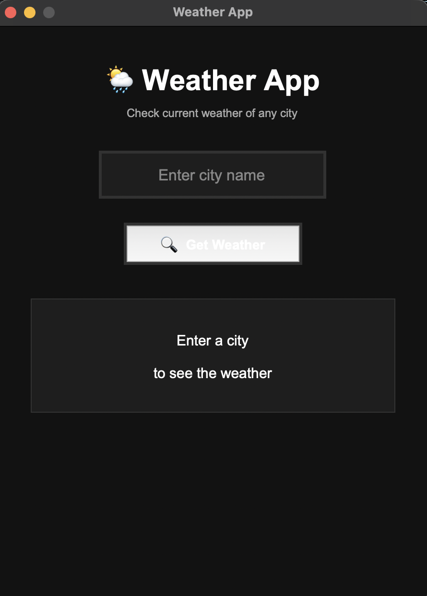
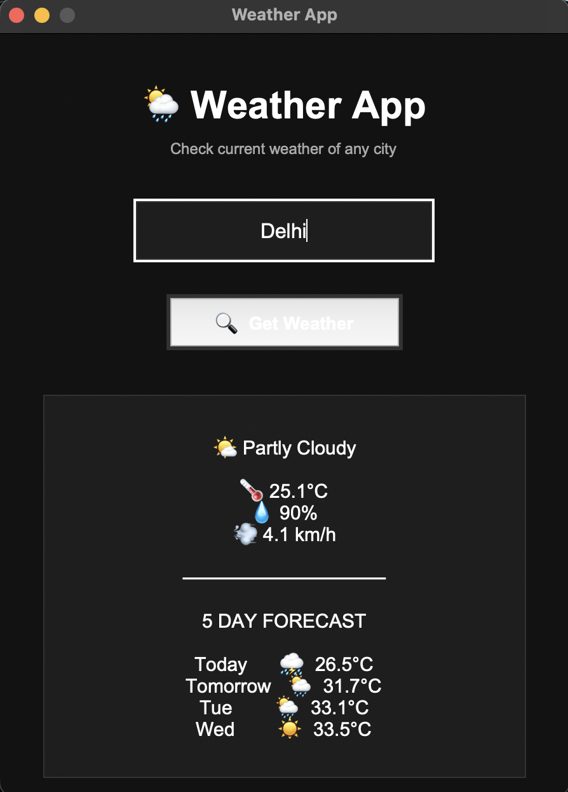

# 🌦️ Weather App

A **Python-based GUI Weather Application** built using **Tkinter** that allows users to search for any city and view its current weather information along with a **5-day forecast**.

The application uses the **Open-Meteo API** to fetch weather and location data.

---

## ✨ Features

* 🌍 Search weather for any city
* 🌡️ Current temperature
* 💧 Relative humidity
* 💨 Wind speed
* 🌤️ Current weather condition
* 📅 5-day weather forecast
* 🔎 City search using geocoding
* ⌨️ Press **Enter** to search
* 🖥️ Simple and clean graphical interface
* ⚠️ Error handling for invalid cities and API errors

---

## 🛠️ Technologies Used

* **Python**
* **Tkinter** – GUI development
* **Requests** – API requests
* **Open-Meteo API** – Weather data
* **Datetime** – Date and forecast handling

---

## 📸 Screenshots

### Interface


### Output


---

## 📂 Project Structure

```text
Weather-App/
│
├── weather_app.py
├── screenshot/
│   ├── interface.png
│   └── output.png
│── .gitignore
└── README.md
```

---

## ⚙️ Installation

### 1. Clone the repository

```bash
git clone https://github.com/AJINKYA250708/Weather-App.git
```

### 2. Open the project folder

```bash
cd Weather-App
```

### 3. Install the required libraries

```bash
pip install requests
pip install urllib3
```

> Tkinter is generally included with Python.

---

## ▶️ How to Run

Run the following command:

```bash
python weather_app.py
```

Then:

1. Enter the name of a city.
2. Click **Get Weather**.
3. View the current weather information.
4. Check the **5-day forecast**.

You can also press **Enter** to search.

---

## 🌐 API

This project uses the **Open-Meteo API** for:

* City coordinates
* Current temperature
* Humidity
* Wind speed
* Weather conditions
* 5-day forecast

No API key is required.

---

## 💡 Future Improvements

* 🌡️ Add feels-like temperature
* 🌅 Add sunrise and sunset timings
* 📍 Add automatic location detection
* 🎨 Add dynamic backgrounds based on weather
* 🌙 Add light/dark mode
* 📊 Add temperature graphs
* 🕐 Add hourly forecast
* 🔄 Add refresh weather button

---

## 🎯 Learning Outcomes

Through this project, I practiced:

* Python GUI development using Tkinter
* Working with REST APIs
* Sending HTTP requests
* Processing JSON data
* Exception handling
* Date and time manipulation
* Building a user-friendly GUI
* Connecting GUI components with backend API data

---

## 👨‍💻 Author

**Ajinkya Mahajan**

B.Tech CSE (Data Science) Student At VIT Chennai

---

## 📜 License

This project is available for educational and personal use.
